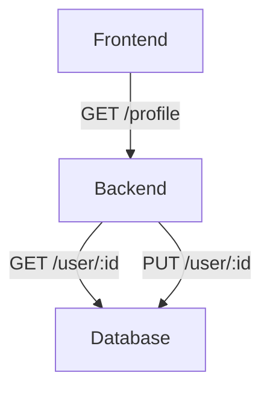

# Desafio Evoé

## Arquitetura do projeto




## Como rodar

```bash
make setup
make start
```

ou

```bash
cd frontend 
npm install
npm start


cd backend
docker compose up -d
npm install
npm run prisma:migrate
npm run dev
```


## Notas do candidato

O desafio consiste em um backend e frontend para uma página de perfil.

Foram desenvolvidos os 4 endpoints mencionados no entanto não ficou claro se as páginas de listagem de usuários e criação de usuários deveriam ser implementadas, então implementei a página de perfil com as funcionalidades de carregar o usuário atual e atualizar o usuário atual.

A sessão de login não foi implementada por conta do prazo do desafio, então levei em consideração mockar o usuário id 1 logado.

A api foi construída com a arquitetura básica do express para prezar o prazo de entrega do desafio, no entanto em um cenário real da construção de um produto produtivo, seria adotada uma arquitetura à altura da necessidade de robustes e escalibidade do projeto.

A api utiliza o prisma como ORM para gerenciar as migrações do banco de dados.

Um docker compose foi construído para garantir a portabilidade do ambiente de desenvolvimento. 

O frontend também foi desenvolvido sob a arquitetura básica do react, apenas adicionando um `react-router-dom` simples, gerenciando a única rota disponível. Também foi adicionado um service base, capaz de comunicar com a api do projeto.

